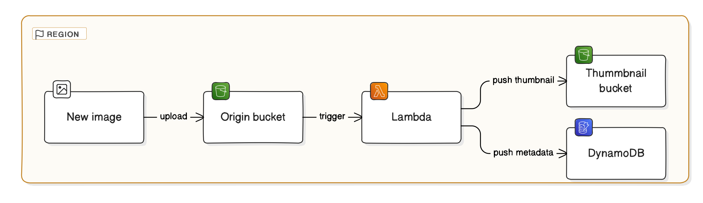

# Thumbnail Creation

This project is designed to generate thumbnails and upload the data information into DynamoDB
from images uploaded to an AWS S3 bucket using AWS Lambda and Terraform.

[](https://github.com/pre-commit/pre-commit)

## Table of Contents

- [Thumbnail Creation](#thumbnail-creation)
  - [Table of Contents](#table-of-contents)
  - [Get Started](#get-started)
    - [Prerequisites](#prerequisites)
    - [Usage](#usage)
    - [Clean Up Resources](#clean-up-resources)
    - [Folder Structure](#folder-structure)
  - [Workflows](#workflows)
  - [Testing Lambda Locally](#testing-lambda-locally)
  - [Troubleshooting](#troubleshooting)
  - [Contributing](#contributing)
  - [Changelog](#changelog)
    - [Version History](#version-history)
    - [Roadmap](#roadmap)
  - [Summary](#summary)
  - [References](#references)
  - [License](#license)

## Get Started

### Prerequisites

Before getting started, make sure you have the following:

- Docker installed
- Visual Studio Code installed
- Recommended VS Code extensions installed (check the "Extensions: show recommended extensions" command)

### Usage

To deploy the infrastructure using Terraform, follow these steps:

1. Generate HCP Terraform account token: You can do this by navigating to [Settings > Tokens](https://app.terraform.io/app/settings/tokens).
2. Create an HCP Terraform Organization and update the `TF_CLOUD_ORGANIZATION` variable in `.devcontainer/.env` with your HCP Terraform Organization name.
3. Start the devcontainer: Open the devcontainer via VSCode, GitHub Codespaces, or other supported environments and select the Terraform container.
4. (Optional) Update the Lambda function: Modify the `src/lambda.py` file, then run the following scripts:

    ```bash
    ./scripts/aws/lambda/00-install-package.sh
    ./scripts/aws/lambda/01-compress-package.sh
    ```

5. Deploy the infrastructure: Run the script to deploy:

   ```bash
   ./scripts/terraform/00-terraform.sh
   ```

6. (Optional) [Testing Lambda locally](#testing-lambda-locally)

### Clean Up Resources

After finishing, you can clean up AWS resources via the Terraform CLI or HCP Terraform Workspace page.

```Shell
terraform plan -destroy -out=destroy.tfplan
terraform apply destroy.tfplan
```

### Folder Structure

The project follows a specific folder structure to organize the code and resources.
Here is an overview of the folder structure: [Read here](docs/folder-structure.md)

Feel free to explore each folder to understand the purpose and contents of each.

## Workflows

The following diagram illustrates the high-level workflow of the project.


## Testing Lambda Locally

To test Lambda functions locally, we utilize AWS SAM (Serverless Application Model).
Detailed steps for setting up and running tests can be found in the documentation: [SAM](docs/sam.md)

## Troubleshooting

For common issues that you may encounter while working with this project,
refer to this document [troubleshooting.md](docs/troubleshooting.md).

## Contributing

Information about contributing to this project can be found in the [CONTRIBUTING.md](/CONTRIBUTING.md) file.

## Changelog

### [Version History](docs/CHANGELOG.md)

### Roadmap

- Terraform vault
- Sphinx
- Use Terraform VCS
- CI/CD pipeline IN Github action, CodePipeline
- Auto release
- Video instruction
- [infracost](https://github.com/infracost/infracost)
- [Hashicorp Sentinel](https://developer.hashicorp.com/sentinel/intro)
- terragrunt a flexible orchestration tool that allows Infrastructure as Code written in OpenTofu/Terraform to scale.
- [checkov](https://github.com/bridgecrewio/checkov/blob/main/README.md)
- terrascan
- tfupdate

## Summary

In this project, you learned:

- How to use Terraform (IaC) and manage it in the cloud with HCP Terraform.
- Explored various AWS services to implement a workflow where uploaded images in S3 trigger a Lambda function to generate thumbnails and update metadata in DynamoDB.
- Set up a development environment using devcontainers for fast and easy project setup.
- Utilized AWS SAM for seamless local testing of Lambda functions.
- Managed repository and CI/CD pipelines using GitHub.
- Created architectural diagrams using diagram-as-code tools.
- Provided detailed documentation of Terraform modules in [`docs/terraform.md`](terraform.md).
- Ensured code quality through pre-commit hooks with tools like Ruff, Gitlint, Gitleaks, Trivy, and more.

For more details, please refer to the [Changelog](#changelog).

## References

- [HCP Terraform Sign up](https://developer.hashicorp.com/terraform/tutorials/cloud-get-started/cloud-sign-up)
- [HCP Terraform setting](https://developer.hashicorp.com/terraform/cli/cloud/settings)

## License

This project is released under the [Mozilla Public License](/LICENSE) by [@Nguyen Tri Man](https://github.com/nguyentriman) ([@cloud-bees](https://github.com/cloud-bees))

© 2024 Nguyen Tri Man. All rights reserved.
